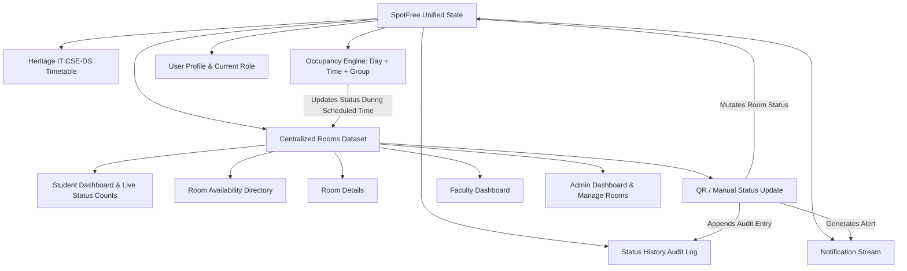

# SpotFree Frontend Implementation Plan (Stitch Prototype as Source of Truth)

## Phase 1 Inspection Report

### 1. Stitch Prototype Inspection
- **Accessible Project**: `15082379788559615816` (*SpotFree Mobile Prototype Sheet*).
  *(Note: Project ID `1521998894373427494` returned 403 Permission Denied; project `15082379788559615816` is owned by the user and contains all 16 SpotFree screens plus the complete interactive prototype).*
- **Visual Design System ("Academic Utility")**:
  - **Fonts**: `Inter` for all typography; `Material Symbols Outlined` for icons.
  - **Primary Colors**: Deep Navy `#0F172A` (structural chrome/headers/buttons), Emerald Green `#10B981` / `#006C49` (Vacant / Free status and affirmative actions), Red/Coral `#EF4444` / `#BA1A1A` (Occupied status), Amber `#F59E0B` (Reserved status), Cool Slate `#64748B` (No Info / Inactive).
  - **Surfaces**: Canvas Background `#F8F9FF`, Card Background `#FFFFFF`, Subdued Track `#EFF4FF`, Dividers `#E2E8F0`.
  - **Status Badges**: Pill shape (9999px border-radius) with colored indicator dot and uppercase label:
    - *VACANT*: Tint `#ECFDF5`, Dot `#10B981`, Text `#065F46`.
    - *OCCUPIED*: Tint `#FEF2F2`, Dot `#EF4444`, Text `#991B1B`.
    - *RESERVED*: Tint `#FFFBEB`, Dot `#F59E0B`, Text `#92400E`.
    - *NO INFORMATION*: Tint `#F8FAFC`, Dot `#64748B`, Text `#334155`.

### 2. All Stitch Screens Found & Inspected
1. **Screen 1 — Login (`1bc2fc90edae475c86acc6dca984b7cd`)**: Role selector (Student / Faculty / Admin), University ID, Passphrase, Remember ID checkbox, SSO key indicator, and Login button.
2. **Screen 2 — Student Dashboard (`39e5f7b1249843b4a6823e7dfe502950`)**: Welcome card, Live Room Status counts for selected building, Find Available Rooms form (Building, Date, Start Time, Duration), Suggest Best Room callout, Scan QR / Enter Room shortcuts, Quick Filters, Featured rooms list.
3. **Screen 3 — Room Availability (`f10e66d58787492aa2f354f0ad480b8c`)**: Building tabs (All, CME, CB, ICT), status counters (Vacant, Occupied, Reserved), filter chips (Floor 1, Floor 2, Classroom, Seminar), room cards list with real-time indicators and "View Details" actions.
4. **Screen 4 — Room Details (`92731fd3f3ee4af7bb29afc3ceb12b67`)**: Room code, building, wing, level, classification, capacity, amenities checklist (AC, projector, outlets, whiteboard), today's visual schedule timeline bar, and "Update Room Status" action.
5. **Screen 5 — Best Room Requirements (`5fd1de75772b4017a38b5966fee4fe6b`)**: Smart Room Finder form: Activity purpose (Study, Group Discussion, Project Work, Meeting), attendee counter (1 to 120), preferred building, duration, amenities checklist.
6. **Screen 6 — Recommended Room (`614522e4e3784ffd908259db43b7d971`)**: Optimal match card (98% match badge), rationale ("Why this room?"), select room action, and alternative vacant rooms list.
7. **Screen 7 — Scan Room QR (`c8579ad934274a858ea820b595881082`)**: Simulated camera viewfinder with target reticle, animated laser scanning line, flashlight toggle, and simulated door plaque scan button.
8. **Screen 7B — Enter Room Number (`e39a488c23cd4bc4b45bc28a59841f59`)**: Manual room code input, quick room shortcuts (CME-104, CB-102, ICT-205, etc.), switch to QR scan link.
9. **Screen 8 — Room Identified (`b37c28eb7b6a486fbee4f7d9c1a155c3`)**: Plaque confirmed card, current live status, room specifications, and "Update Room Status" trigger.
10. **Screen 9 — Update Room Status (`fe8efc896ffe4c3f8930abdcc721fc96`)**: Interactive selection among VACANT, OCCUPIED, RESERVED; conditional "Reserved Until" time selector; remarks/notes field; "Broadcast Status Change" button.
11. **Screen 10 — Status Updated (`92f4fda9b587485eb84f9dd48ee43f2b`)**: Confirmation badge, Previous vs New status comparison card, "Updated Just now", reporter identity, return to dashboard and audit history links.
12. **Screen 11 — Admin Dashboard (`66aba2b355e542ac803e5ae0adf7c711`)**: Campus space metrics (Total, Vacant, Occupied, Reserved, No Info), building breakdown cards (CME, CB, ICT), quick navigation to Manage Rooms and Status History.
13. **Screen 12 — Manage Rooms (`ffd1547358484596816b54bf48e66066`)**: Room catalog with search bar, filter chips (Building, Type, Status), Add Room modal trigger, Edit Room action per card.
14. **Screen 13 — Status History (`dae65770c9ec47379c309039b4aabba7`)**: Live audit log of room status changes with transition cards (Previous → New), timestamp, updatedBy, and source (QR, MANUAL, TIMETABLE).
15. **Screen 14 — Notifications (`b2d7ecef4f094cd2a66c5c383d07f4c0`)**: Notification stream (All / Unread tabs, status update alerts, mark all as read action).
16. **Screen 15 — Profile (`53c35806d8db43a5bb18b3c222f1231d`)**: User card (Avatar, name, ID, role badge, department), campus authorization info, simulated logout modal.
17. **Screen 16 — My Timetable (`9ab455515e3043e78e0e779da04cd8d8`)**: Academic room scheduling for HIT B.Tech CSE (DS) 2nd Year 1st Sem; Cohort Group selector (Group 1 / Group 2); Day selector (Mon–Fri); scheduled class cards with room links (CME604, CB501, ICT B08, etc.); live status indicator showing scheduled occupancy during class periods; simulated timetable upload/replace.
18. **Faculty Portal / Flow**: Dedicated Faculty Dashboard with quick QR/Manual room status updates and status audit access.

### 3. Current Next.js Structure & Dependencies
- Directory: `D:\spotfree\frontend`
- Framework: Next.js 16.3.5 (App Router)
- React: 19.2.8
- Tailwind CSS: v4 (`@tailwindcss/postcss` & `tailwindcss`)
- Existing files: `app/layout.tsx`, `app/page.tsx`, `app/globals.css` (plain boilerplate)

### 4. Components to be Shared
- `Header`: Standard app header with SpotFree HIT branding, back navigation button, notification bell with unread badge, and role/user avatar.
- `BottomNavigation`: Persistent mobile bottom nav bar (Dashboard, Scanner, Availability / History, Admin) with active state highlights.
- `StatusBadge`: Unified pill component supporting `VACANT`, `OCCUPIED`, `RESERVED`, and `NO INFORMATION`.
- `RoomCard`: Centralized room card presentation used across Availability and Manage Rooms.
- `BuildingCard`: Building summary and live status metrics widget.
- `LiveBanner`: Broadcast banner for instantaneous feedback when any room's status changes.
- `Toast`: Global feedback toast for instant action confirmations.
- `Modal`: Accessible modal container for Add Room, Edit Room, Reset Password, and Logout confirmations.

---

## Data and State Architecture (One Source of Truth)

All screens interact with a unified reactive React Context (`SpotFreeContext`):



### 1. Centralized Rooms Data Model
```typescript
interface Room {
  id: string; // e.g. 'CME-104', 'CME-604', 'CB-501', 'ICT-B08', 'ICT-403'
  roomNumber: string;
  building: 'CME' | 'CB' | 'ICT';
  floor: number;
  type: 'Classroom' | 'Seminar Room' | 'Meeting Room' | 'Study Room';
  capacity: number;
  status: 'VACANT' | 'OCCUPIED' | 'RESERVED' | 'NO INFORMATION';
  timeText: string;
  amenities: string[];
  timeline: { time: string; text: string; status: 'Ended' | 'Active' | 'Upcoming' }[];
}
```

### 2. Timetable & Scheduled Occupancy Engine
The application embeds the authentic Heritage Institute of Technology timetable:
- **Programme**: B.Tech 2nd Year 1st Semester, CSE (Data Science), Session 2026–2027 (Effective 20.07.2026).
- **Rooms**: CME604, CB501, ICT B08, ICT403, etc.
- **Subjects**: Data Structures & Algorithms (CSEN2101), Computer Organization & Architecture (CSEN2102), Programming Practice (CSEN2151), etc.
- **Group 1 & Group 2**: Dynamic filtering based on active group.
- **Live Room Synchronization**: A reactive engine matches the active simulated Day and Time (e.g., Monday 10:00–11:00 AM) against scheduled classes. During class hours, the designated room automatically reflects `OCCUPIED` with the scheduled subject name across the entire application (Student Dashboard, Live Counts, Availability, Room Details, and Admin screens). Outside scheduled slots, the status reverts or defaults to open/vacant.

### 3. QR / Manual Update Engine
- Simulation mode allows scanning a vector QR code plaque or typing any room ID.
- Status update choices: `VACANT`, `OCCUPIED`, `RESERVED` (with "Reserved Until" time).
- Status change immediately mutates the central room state and appends a record to `statusHistory` with source: `QR`, `MANUAL`, or `TIMETABLE`.

---

## Proposed Changes

### Configuration & Global Styles
- Modify [frontend/app/globals.css](file:///D:/spotfree/frontend/app/globals.css):
  - Import Google Fonts (`Inter` and `Material Symbols Outlined`).
  - Configure Stitch design tokens: background `#f8f9ff`, surface `#ffffff`, primary `#0f172a`, secondary `#10b981`, surface-container colors, text colors, and custom utilities.
- Modify [frontend/app/layout.tsx](file:///D:/spotfree/frontend/app/layout.tsx):
  - Setup Inter font, meta title "SpotFree — Campus Room Availability", viewport settings, and wrap app in `SpotFreeProvider`.

### Context & State
- Create [frontend/lib/types.ts](file:///D:/spotfree/frontend/lib/types.ts):
  - Type definitions for Rooms, Timetable entries, Status History, Notifications, Roles, and User profiles.
- Create [frontend/lib/mockData.ts](file:///D:/spotfree/frontend/lib/mockData.ts):
  - Initial dataset of HIT classrooms (CME-101 to CME-604, CB-102 to CB-501, ICT-205 to ICT-B08).
  - HIT CSE-DS 2026-2027 timetable dataset with Group 1/2 breakdowns.
  - Initial status history and notification items.
- Create [frontend/context/SpotFreeContext.tsx](file:///D:/spotfree/frontend/context/SpotFreeContext.tsx):
  - Unified React Context managing active role, active screen/view, room statuses, timetable simulation (day/time/group), history log, notifications, and status mutation functions.

### Shared UI Components
- Create [frontend/components/Header.tsx](file:///D:/spotfree/frontend/components/Header.tsx):
  - Sticky mobile header matching Stitch, displaying logo, title, back button, notifications bell, and user avatar.
- Create [frontend/components/BottomNavigation.tsx](file:///D:/spotfree/frontend/components/BottomNavigation.tsx):
  - Role-aware bottom navigation bar (Dashboard, Scanner, Availability/History, Admin).
- Create [frontend/components/StatusBadge.tsx](file:///D:/spotfree/frontend/components/StatusBadge.tsx):
  - Precise status badges (VACANT, OCCUPIED, RESERVED, NO INFORMATION) matching Stitch exact styling.
- Create [frontend/components/RoomCard.tsx](file:///D:/spotfree/frontend/components/RoomCard.tsx):
  - Reusable room card for directory and management views.
- Create [frontend/components/Toast.tsx](file:///D:/spotfree/frontend/components/Toast.tsx) & [frontend/components/LiveBanner.tsx](file:///D:/spotfree/frontend/components/LiveBanner.tsx):
  - Instant notification toast and live sync banner.

### Screen Implementations
- Create [frontend/components/screens/LoginScreen.tsx](file:///D:/spotfree/frontend/components/screens/LoginScreen.tsx) (Screen 1)
- Create [frontend/components/screens/StudentDashboard.tsx](file:///D:/spotfree/frontend/components/screens/StudentDashboard.tsx) (Screen 2)
- Create [frontend/components/screens/RoomAvailabilityScreen.tsx](file:///D:/spotfree/frontend/components/screens/RoomAvailabilityScreen.tsx) (Screen 3)
- Create [frontend/components/screens/RoomDetailsScreen.tsx](file:///D:/spotfree/frontend/components/screens/RoomDetailsScreen.tsx) (Screen 4)
- Create [frontend/components/screens/BestRoomRequirementsScreen.tsx](file:///D:/spotfree/frontend/components/screens/BestRoomRequirementsScreen.tsx) (Screen 5)
- Create [frontend/components/screens/RecommendedRoomScreen.tsx](file:///D:/spotfree/frontend/components/screens/RecommendedRoomScreen.tsx) (Screen 6)
- Create [frontend/components/screens/ScanRoomQRScreen.tsx](file:///D:/spotfree/frontend/components/screens/ScanRoomQRScreen.tsx) (Screen 7)
- Create [frontend/components/screens/EnterRoomNumberScreen.tsx](file:///D:/spotfree/frontend/components/screens/EnterRoomNumberScreen.tsx) (Screen 7B)
- Create [frontend/components/screens/RoomIdentifiedScreen.tsx](file:///D:/spotfree/frontend/components/screens/RoomIdentifiedScreen.tsx) (Screen 8)
- Create [frontend/components/screens/UpdateRoomStatusScreen.tsx](file:///D:/spotfree/frontend/components/screens/UpdateRoomStatusScreen.tsx) (Screen 9)
- Create [frontend/components/screens/StatusUpdatedScreen.tsx](file:///D:/spotfree/frontend/components/screens/StatusUpdatedScreen.tsx) (Screen 10)
- Create [frontend/components/screens/FacultyDashboard.tsx](file:///D:/spotfree/frontend/components/screens/FacultyDashboard.tsx)
- Create [frontend/components/screens/AdminDashboard.tsx](file:///D:/spotfree/frontend/components/screens/AdminDashboard.tsx) (Screen 11)
- Create [frontend/components/screens/ManageRoomsScreen.tsx](file:///D:/spotfree/frontend/components/screens/ManageRoomsScreen.tsx) (Screen 12)
- Create [frontend/components/screens/StatusHistoryScreen.tsx](file:///D:/spotfree/frontend/components/screens/StatusHistoryScreen.tsx) (Screen 13)
- Create [frontend/components/screens/NotificationsScreen.tsx](file:///D:/spotfree/frontend/components/screens/NotificationsScreen.tsx) (Screen 14)
- Create [frontend/components/screens/ProfileScreen.tsx](file:///D:/spotfree/frontend/components/screens/ProfileScreen.tsx) (Screen 15)
- Create [frontend/components/screens/MyTimetableScreen.tsx](file:///D:/spotfree/frontend/components/screens/MyTimetableScreen.tsx) (Screen 16)
- Update [frontend/app/page.tsx](file:///D:/spotfree/frontend/app/page.tsx):
  - Main router view container mounting the active screen inside the mobile-first layout.

---

## Verification Plan

### Automated Build & Lint Verification
- Run `npm run lint` in `D:\spotfree\frontend`.
- Run `npm run build` or start `npm run dev` to verify complete compile without TypeScript or bundle errors.

### Manual & Interactive Browser Verification
Using Antigravity's browser agent / local server validation:
1. **Login & Role Selection**:
   - Verify role switcher between Student, Faculty, and Admin works.
   - Login as Student opens Student Dashboard.
   - Login as Faculty opens Faculty Dashboard.
   - Login as Admin opens Admin Dashboard.
2. **Student Flow**:
   - Room search form navigates to Room Availability with building filter preselected.
   - Room card click navigates to Room Details.
   - "Suggest Best Room" navigates to Step 1 Requirements, and submitting displays Step 2 Recommended Room.
3. **Timetable & Occupancy Engine**:
   - Navigate to My Timetable.
   - Switch between Group 1 and Group 2; observe practical class slots toggle.
   - Switch simulated day/time (e.g. Mon 10:00 AM) and verify CME604 is marked OCCUPIED across Dashboard, Availability, and Room Details.
   - Click "Replace Timetable" simulation and verify feedback.
4. **QR / Manual Status Update Flow**:
   - Click "Scan Room QR" or "Enter Room No.".
   - Simulate plaque scan for CME-104 or enter room number.
   - Room is identified (Screen 8).
   - Click "Update Room Status" (Screen 9), select OCCUPIED, submit.
   - Screen 10 (Status Updated) appears.
   - Verify status change immediately propagates to Dashboard counts, Availability list, and Status History.
5. **Admin Operations**:
   - Admin Dashboard reflects exact live counts for Total, Vacant, Occupied, Reserved.
   - Manage Rooms: search works, filters work, Add Room modal adds new room, Edit Room updates capacity/status.
   - Status History shows chronological transition log.
6. **Auxiliary Views**:
   - Notifications screen displays alerts, mark all as read works.
   - Profile screen displays user details and logout confirmation.
   - Back navigation works from all sub-screens.
